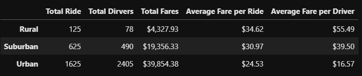
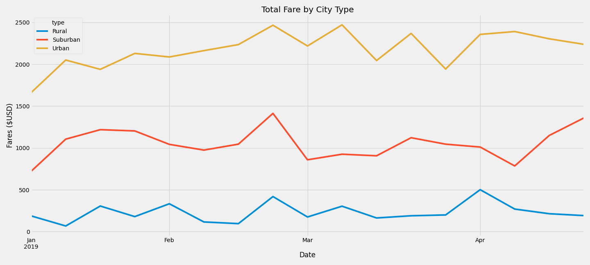

# PyBer Analysis

## Overview 

V. Isualize, the CEO of the multi Billion dollar company PyBer, a ride-sharing service, has tasked us with performing analysis on two csv files filled with ride-sharing data from cities across the county. We are to summarize the data into city type (urban, suburban, and rural) to determine the coverage of drivers and riders across the difference city types as well as determining the fares in each location. In the end we created a line graph that shows the total fares for each city type for a week from January to April of 2019. This provides a visualization of how the data differs in different types of cities.  

## Results

To begin this analysis we determined the following information for each city type from the merged .csv files: total rides, total drivers, total fares, average fare per ride, average fare per driver, and total fare by city type. This is all displayed in the PyBer_Summary_df DataFrame seen below. 

Taking a quick look at the numbers in the figure above, the total rides, drivers, and fares per city type all make sense. There are more rides taken, more drivers available, and higher fares collected in more densely populated areas versus more rural areas. At first it looks like the riders in rural areas are paying much higher fares compared to those in urban areas. It is important to remember that people in urban areas tend to take shorter rides around the city, versus those in rural areas that often travel further to reach their destinations. 

The numbers from this chart can only tell so much of the story. To get a better idea of the values, we performed some more analysis on the numbers and plotted the values into the line chart. The line graph shows the date from January to April of 2019 on the x-axis and the Fares ($USD) on the y-axis. This graph helps verify the total rides, total drivers, and total fares per city type. Obviously, there are more drivers and riders in urban areas compared to rural areas. Having more drivers and riders also means that urban areas collect the most amount of money from fares as well. 

## Summary

After performing analysis on the PyBer data, here are 3 recommendations for the company to make to help address a few disparities between the types of cities. 

1.) Place a limit on the number of drivers in the urban cities. In both the rural and suburban city types, there are fewer drivers than rides taken during the timeframe. In urban areas there are 800 more drivers than there were rides taken.

2.) Consider lowering the fares for rural araes, while slightly raising the fares for urban areas. A lower fare in rural areas would help draw in more riders. More riders and a slight raise in urban fares would more than make up for the lose of money in rural areas. 

3.) 
